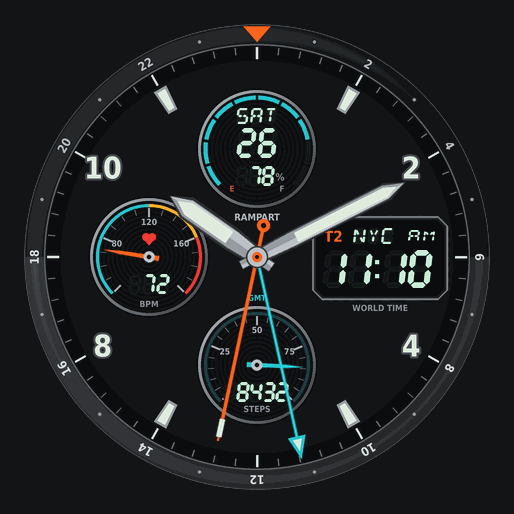
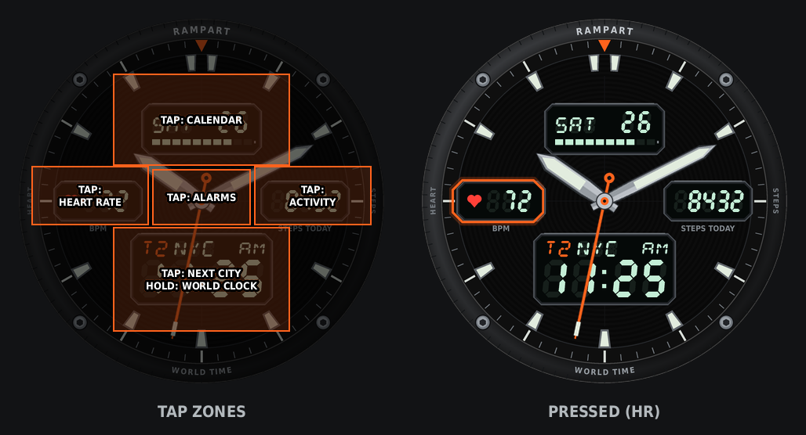
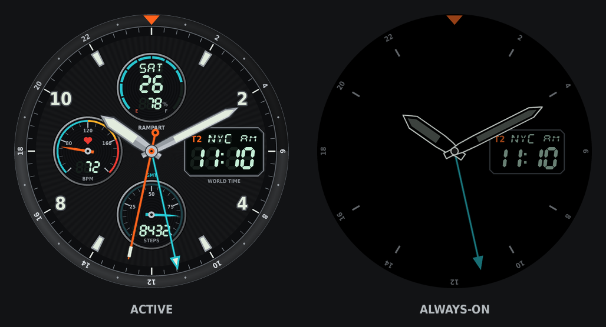

# Rampart: a rugged ana-digi watch face for the Amazfit Active 2 (Round)



Rampart is an open-source Zepp OS watch face. It pairs analog hands with negative-display LCD windows and shows a **second time zone** as its main digital readout.

| Window | Shows |
|---|---|
| Hands | Local time (hour, minute, sweeping second hand) |
| **T2** (bottom) | Second time zone: city code + HH:MM, with AM/PM when the watch is set to 12-hour time. **Tap it** to cycle through the world clocks on your watch, then UTC. Your choice is remembered. |
| Top | Weekday, day of month, 10-segment battery bar (turns orange at 20% or less) |
| Left | Heart rate: the last measurement, `--` until the sensor has one |
| Right | Steps today |

The always-on display keeps the hands (outlined) and the T2 window, dimmed.

### Tap zones

| Tap | Opens |
|---|---|
| Date / battery window | Calendar |
| Heart-rate window | Heart Rate |
| Steps window | Activity |
| Centre (around the hands) | Alarms |
| T2 window | **tap:** next city → … → UTC · **hold:** World Clock |

Each zone is larger than the window it covers (fingertips are big on a 33 mm screen), and the window gets an orange frame while you're pressing it.





**Target:** Amazfit Active 2 **Round**: 466×466, Zepp OS 4.x, API level 3.0+. It won't fit the Active 2 *Square* (390×450) without a new layout.

---

## Install (users)

- **From amazfitwatchfaces.com:** download it from the Rampart page and install it with the AmazFaces app, or however the page describes.
- **From GitHub:** download the latest file from [Releases](../../releases), or build it yourself (below).

### Setting up T2
T2 reads the **World Clock** cities configured on your watch or in the Zepp app. If none are set, it shows **UTC**. Tap the T2 window to step through your cities and then UTC.

---

## Build from source (developers)

Requirements: [Node.js LTS](https://nodejs.org), Python 3.10+ (only needed to regenerate artwork), and the Zepp phone app with **Developer Mode** turned on.

```bash
npm install -g @zeppos/zeus-cli
git clone https://github.com/soumiks17/rampart-watchface.git
cd rampart-watchface
npm test            # logic + mocked-platform smoke tests
npm run build       # -> app/dist/*.zab
```

**On the simulator:** install the Zepp OS Simulator from the Zepp developer site, choose the Active 2 (Round), and run `npm run dev`.

**On your watch:**
1. In the Zepp app, open Profile → Settings → About and tap the Zepp logo 7 times to turn on Developer Mode.
2. `cd app && zeus login` (once).
3. `npm run preview` prints a QR code. Scan it from the Zepp app's Developer Mode → Scan.

### Regenerating the artwork
Everything visual is generated from code in `tools/`. No fonts or third-party images are baked in, except the bezel lettering, which uses DejaVu Sans Condensed Bold (a free license).

```bash
pip install -r requirements.txt
npm run assets      # rebuilds every PNG, app/watchface/layout.js, previews and icon
```

`tools/layout.py` is the single source of truth for positions. The generator bakes the static parts into `bg.png` and writes the same numbers to `app/watchface/layout.js`, so the live digits always land on their ghost segments.

## Project layout

```
app/                       Zepp OS project root (run zeus here)
  app.json                 target: active-2-round, 8 deviceSource ids, designWidth 466
  watchface/index.js       the only file that touches @zos/* APIs
  watchface/logic.js       pure display logic (tested under Node)
  watchface/layout.js      GENERATED geometry
  assets/active-2-round/   icon + images (GENERATED)
tools/                     Python asset generator + preview renderer
test/                      node:test suites (kept outside app/: zeus bundles every .js under app/)
docs/                      previews for README and the portal listing
```

## Notes and known limits

- Built on the modern `@zos/*` module API. The old `hmUI` / `hmSensor` globals don't exist on this runtime.
- Heart rate uses `HeartRate.getLast()`. On a real watch, `getCurrent()` reads 0 unless a continuous measurement is running. Turn on heart-rate monitoring in the watch's health settings for regular updates.
- `WorldClock` needs API level 3.0. The face reads each city's reported hour/minute and falls back to the zone offset.
- Tap zones are transparent `BUTTON` widgets (the pattern community Zepp OS faces use). App shortcuts use `launchApp({ appId: SYSTEM_APP_*, native: true })` from `@zos/router` (API 3.0). To change what a zone opens, edit `TAP_ACTIONS` at the top of `app/watchface/index.js`.
- **Not yet verified on hardware:** app launching from the watch-face layer, and `localStorage` persistence. If a firmware refuses a jump, that tap does nothing rather than crashing the face. Issues and PRs are welcome.

## Credits

- Design and code: Soumik Sen ([@soumiks17](https://github.com/soumiks17)).
- Runtime findings for the Active 2 (the `@zos` API mapping, `getLast()` vs `getCurrent()`, the deviceSource list) come from [duynnguyen22/ZeppOS_mywatchface](https://github.com/duynnguyen22/ZeppOS_mywatchface).
- TIME_POINTER usage follows [zepp-health/zeppos-samples](https://github.com/zepp-health/zeppos-samples).

## License

[MIT](LICENSE). This covers the code and the generated artwork. Fork it, remix it, and ship your own variants.
